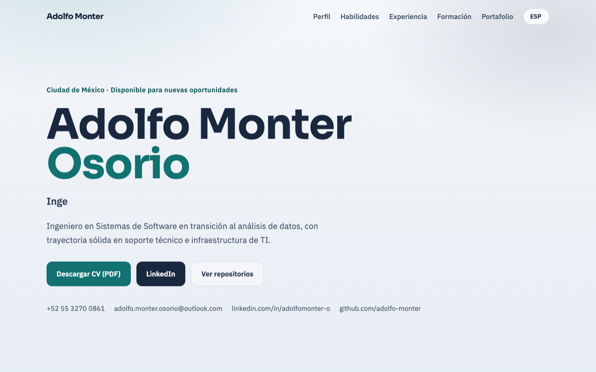

# Currículum web — Adolfo Monter Osorio

Versión digital de mi currículum profesional, construida con HTML, CSS y JavaScript.

**Ver en vivo:** [https://adolfo-monter.github.io/curriculum/](https://adolfo-monter.github.io/curriculum/)



## ¿Por qué existe este proyecto?

Además del CV en PDF (plano para filtros ATS y diseño para envío directo a reclutadores), creé esta versión web para **demostrar con un proyecto real** lo que puedo hacer en front-end.

No basta con listar “HTML, CSS y JavaScript” en un documento: aquí se ve el resultado — diseño limpio, estructura organizada, responsivo, multilenguaje y descarga del CV en un solo enlace.

## ¿Qué incluye?

- Perfil profesional, stack técnico, experiencia y formación
- Diseño responsivo (escritorio y móvil) con menú adaptable
- Cambio de idioma: español, inglés y francés
- Descarga del CV en PDF (versión con diseño)
- Organización por carpetas: `css/`, `js/` y `assets/`

## Tecnologías

- HTML5
- CSS3
- JavaScript (vanilla, sin frameworks)
- Google Fonts: **Sora** + **IBM Plex Sans**

## Estructura

```text
.
├── index.html
├── README.md
├── css/
│   └── styles.css
├── js/
│   └── script.js
└── assets/
    ├── Adolfo_Monter_Osorio_CV_Diseno.pdf
    └── preview-desktop.png
```

## Proyectos relacionados

Otros repositorios de mi perfil en GitHub:

| Proyecto | Descripción | Enlace |
|---|---|---|
| `curriculum` | Este currículum web | [github.com/adolfo-monter/curriculum](https://github.com/adolfo-monter/curriculum) |
| `casa-peche` | Sitio web de Casa Peche | [github.com/adolfo-monter/casa-peche](https://github.com/adolfo-monter/casa-peche) |
| `Curso_Python_practicas` | Prácticas de Python | [github.com/adolfo-monter/Curso_Python_practicas](https://github.com/adolfo-monter/Curso_Python_practicas) |
| `Curso_SQL_practicas` | Prácticas de SQL | [github.com/adolfo-monter/Curso_SQL_practicas](https://github.com/adolfo-monter/Curso_SQL_practicas) |
| `html-css-interactive-guide` | Guía interactiva HTML/CSS | [github.com/adolfo-monter/html-css-interactive-guide](https://github.com/adolfo-monter/html-css-interactive-guide) |

Perfil: [github.com/adolfo-monter](https://github.com/adolfo-monter)

## Cómo verlo en local

```bash
python3 -m http.server 8765
```

Abre: http://127.0.0.1:8765/

## Autor

**Adolfo Monter Osorio**  
Ingeniero en Sistemas de Software · Analista de Datos Junior · Soporte Técnico IT  
Ciudad de México

- LinkedIn: [linkedin.com/in/adolfomonter-o](https://linkedin.com/in/adolfomonter-o)
- GitHub: [github.com/adolfo-monter](https://github.com/adolfo-monter)
- Currículum en vivo: [adolfo-monter.github.io/curriculum](https://adolfo-monter.github.io/curriculum/)
